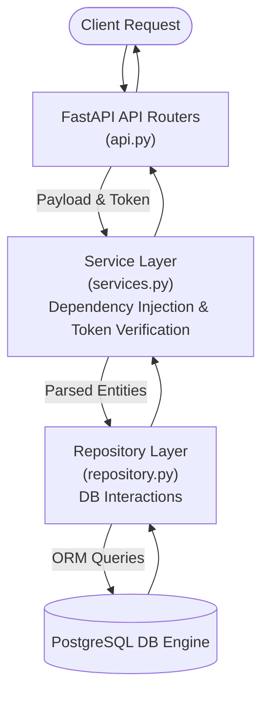

# Project Introduction & Architecture Overview

## 1. About the System

This platform is an enterprise-grade B2B retail and e-commerce system built to empower local shopkeepers. It serves as a modular, high-performance backend that completely digitalizes daily workflows—ranging from robust inventory tracking and seamless customer profile management to securing complex transactions. A foundational principle of this architecture is strict adherence to a clean separation of concerns. The codebase is elegantly layered across **Schemas** (data validation), **Services** (business logic), **Repositories** (database interactions), and **API Routers** (request handling), ensuring the system remains scalable, maintainable, and thoroughly decoupled.

## 2. Core Tech Stack

- **FastAPI**: An asynchronous, high-performance web framework for building APIs that provides built-in validation and automatic OpenAPI/Swagger documentation out of the box.
- **Pydantic**: Provides robust data validation and settings management using Python type hinting, ensuring that input payloads (e.g., `SignupUser`, `ShowProfile`, `UpdateUser`) are strictly validated before hitting the business logic.
- **SQLAlchemy (Async)**: An Object-Relational Mapping (ORM) layer utilized to write clean, asynchronous, and database-agnostic queries.
- **PostgreSQL**: A production-grade relational database optimized for ACID-compliant transactional data storage, serving as the single source of truth for Users, Shops, and Inventory.
- **JWT (JSON Web Tokens)**: A highly secure, stateless, bearer-token-based authentication mechanism responsible for protecting shopkeeper endpoints and managing session lifecycles.

## 3. Architecture Design Flowchart

